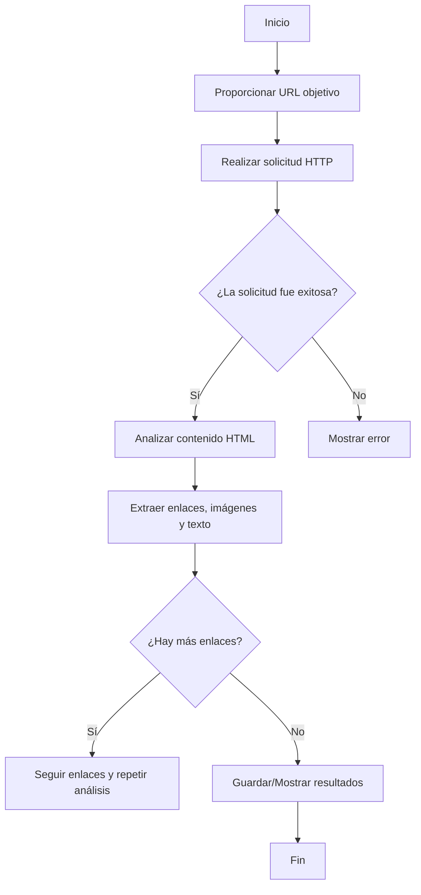

# Web Scraping: Búsqueda de Links

Este proyecto realiza web scraping para buscar y extraer enlaces de páginas web. Utiliza Python y bibliotecas como `requests` y `BeautifulSoup` para realizar las solicitudes HTTP y analizar el contenido HTML. Además, permite:

- Ingresar a las páginas web que se especifiquen.
- Extraer imágenes y texto, excluyendo las etiquetas HTML.
- Buscar enlaces dentro de las páginas y, si se encuentran, seguirlos para continuar el análisis.
- Limitar el análisis a un máximo de 5 enlaces por defecto, con la posibilidad de aumentar este límite según se especifique.
- Analizar únicamente los enlaces disponibles en la página objetivo.

Este proyecto está diseñado para ser ejecutado en Google Colab. En el caso de Colab, puedes montar tu Google Drive para guardar y acceder a los archivos generados durante el análisis.

## Requisitos

- Python 3.x
- Bibliotecas necesarias:
  - `requests`
  - `beautifulsoup4`

## Uso

1. Ejecuta el script principal o el notebook para realizar el scraping.
2. Proporciona la URL objetivo y analiza los resultados.
3. Si usas Google Colab, monta tu Google Drive con el siguiente código:
   ```python
   from google.colab import drive
   drive.mount('/content/drive')
   ```

## Flujograma


